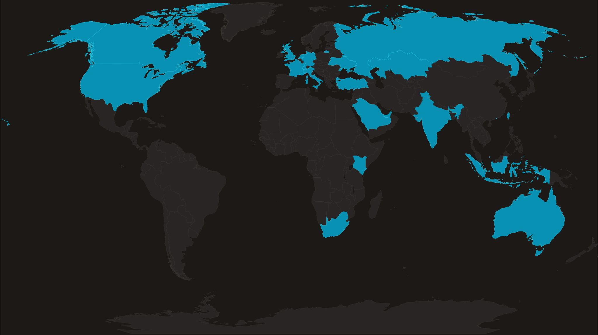

Hi 👋 My name is Sundar Balamurugan
=======================

Computer Vision Engineer 💻
-----------------------

* 🌍  I'm based in India
* ✉️  You can contact me at [sundarbala36663@gmail.com](mailto:sundarbala36663@gmail.com)
* 🧠  I'm a Computer Vision Engineer
* 🤝  I'm open to collaborating on interesting projects
* ⚡  Love for Programming
* 🌐  Served 70+ clients globally
* 🐳  Proficient in Docker, FastAPI, AWS, and Machine Learning

  

  
  
  
  

### 🚀 Featured Projects
-----------------------

| Project | Description |
| --- | --- |
| [signspell](https://pypi.org/project/signspell/) | ASL fingerspelling recognition (LSTM + MediaPipe), published to PyPI |
| [numly](https://pypi.org/project/numly/) | Multi-numeral-system converter, published to PyPI |

### 🌍 Clients Across the Globe
-----------------------

  

### 🧠 Skills
-----------------------

### Programming Languages

  
  
  
  

### AI & ML / Computer Vision

  
  
  
  
  
  

### Cloud & DevOps

  
  
  

### Backend Development

  
  

### Databases

  
  
  
  

### Application Development

  
  

### 🔗 Socials

### 📊 Badges

<b>My GitHub Stats</b>

